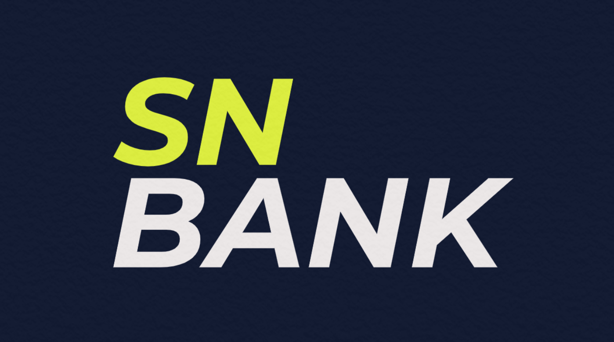
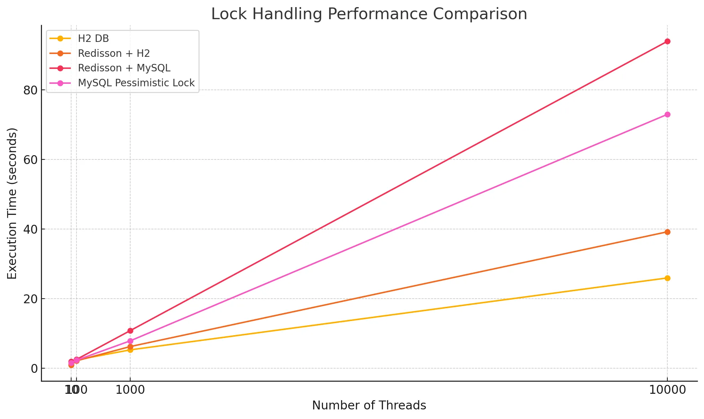
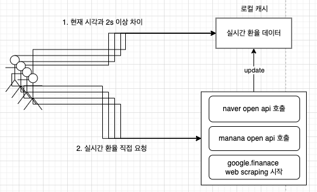
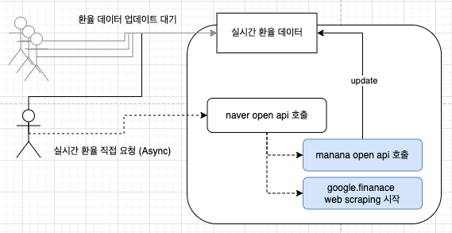
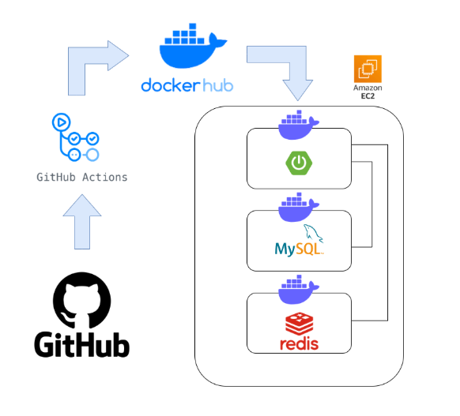
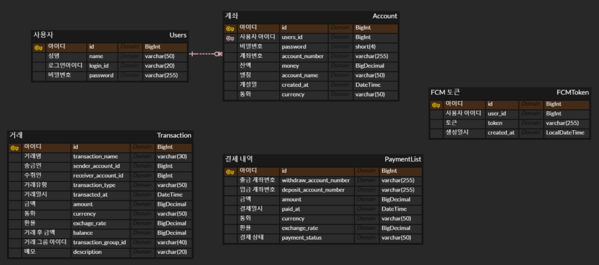

# SN BANK

## 🗂 프로젝트 정보

- **프로젝트명**:  SN BANK
- **진행 기간**: 2025.01.13 ~ 2025.01.24
- **팀원:** 송준환, 고나영, 김중환, 박지은, 이혜성

## ✨ 서비스 개요

### 🎯 프로젝트 목표

- **동시성 문제**로 인한 데이터 불일치 및 데드락 방지
- **환율 API 연동**으로 원화·외화 간 실시간 환전 지원
- **트랜잭션 분리 및 락 설계**로 데이터 무결성 보장

### 🏅 주요 성과

- **비관적 락 + Redisson 락** 적용으로 동시성 제어
- **락 순서 고정 로직**으로 데드락 방지
- **CompletableFuture**를 활용한 환율 비동기 처리

## 💻 사용 기술 스택

| 구분 | 기술 스택 |
| --- | --- |
| **Backend** | Java 17, Spring Boot 3, Spring Security, JPA |
| **Database** | MySQL |
| **Infra & DevOps** | AWS EC2, Docker, GitHub Actions, ECR |
| **Monitoring** | Prometheus, Grafana, Spring Actuator |
| **Notification** | Firebase Cloud Messaging (FCM) |
| **ETC** | Swagger, JWT, ReentrantLock, Redisson, AES 암호화 |

---

## 🧑‍💻 나의 역할

### 결제 및 이체 기능 구현 및 동시성 제어

**기술 스택**: Java, Spring Boot, JPA, MySQL

- 사용자 간 **이체 및 결제 기능 구현**
- **송신/수신 계좌 검증 → 잔액 갱신 → 거래 내역 생성**의 단일 트랜잭션 흐름 설계
- 결제 요청은 내부 계좌 간 이체 방식으로 처리
    - 예: 개인 계좌 → 문화센터(법인) 계좌
    - 추후 외부 은행/PG사 연동 가능성 고려

**⚠️ 주요 이슈**

- ✅ 동시성 문제로 인한 데이터 불일치 및 데드락 발생
    - *비관적 락(Pessimistic Lock)**을 적용하여 데이터 정합성 확보
    - **락 획득 순서 고정 로직** 구현:
        - 계좌 번호 사전순 기준으로 락 순서 통일 → 데드락 방지
        - (예: A → B vs B → A 요청 충돌 방지)
    - **REPEATABLE_READ 격리 수준** 적용으로 트랜잭션 중 데이터 불변성 확보
- ✅ **성능 저하 및 락 점유 시간 증가**
    - **외부 API 호출(환율 조회)** 시 발생하는 레이턴시로 트랜잭션 지연 발생
    - 트랜잭션 내부에 외부 호출을 포함하지 않기 위해 **트랜잭션 분리 전략 적용**
        - **송신 계좌 처리 트랜잭션**과 **수신 계좌 처리 트랜잭션**을 분리
        - 트랜잭션 전에 환율 조회를 미리 수행 → 실패 시 트랜잭션 실행 자체 방지
    - 결과적으로 **DB 락 점유율 감소** 및 **이체 처리 성능 개선**

### 📈 비관적 락 vs Redisson 락 성능 비교

- **테스트 조건**
    - 송금 시 1원씩 n번 반복 전송
    - 스레드 수: 10, 100, 1000, 10000
    - 비교 대상: H2 비관적 락, MySQL 비관적 락, Redisson+H2, Redisson+MySQL

- **결과**
    - 단일 서버 환경 → MySQL 비관적 락이 빠름
    - 분산 환경 → Redisson 락이 병목 감소, 성능 우위
    - 개선점**:** 트랜잭션 내 락 범위를 최소화해 점유 시간 축소

### 환율 API 연동

**기술 스택**: Java, Spring Boot, WebClient

- **기능 구현**
    - **Open Exchange Rates API** 연동으로 실시간 환율 수집
    - 원화 ↔ 외화 간 이체 시 실시간 환전 계산
    - 환율 데이터는 서비스 계층에서 처리 → 트랜잭션 분리

**⚠️ 주요 이슈**:

- API 호출 지연·실패 시 서비스 영향
    - 커스텀 예외 및 fallback 처리
    - 비동기 호출 + timeout 설정
    - 중복 호출 방지를 위해 호출 스레드 1개 제한

### 🏗 환율 Open API 설계

### 초기 설계

- 외부 Open API를 사용해 환율 데이터 응답
- 외부 Open API 많은 호출 시 호출 제한 예상 및 중복 요청 문제 발생
- 외부 Open API 호출 로직 1개의 스레드로 제한

### 최종 설계

- Open API 호출 비동기로 진행하여 가장 빠르게 응답 오는 값만 사용하고 탈출
- 비동기 설계 → timeout 설정

---

## 💻시스템 아키텍처

---

## 📊 데이터 구조

- 자주 변경되는 고객 요구사항을 효율적으로 대처하기 위해 테이블 간 의존성을 줄임
- 가능한 독립적인 설계를 위해 연관관계를 최소화

## **📄 API 명세**

| 구분 | 기능 | 메서드 | 엔드포인트 | 응답 코드 |
| --- | --- | --- | --- | --- |
| 사용자 | 사용자 정보 가져오기 | GET | `/users/{id}` | 200, 404 |
|  | 회원가입 | POST | `/users` | 201, 400 |
|  | 로그인 | POST | `/users/login` | 200, 401 |
|  | 로그아웃 | GET | `/users/logout` | 200, 400 |
| 계좌 | 계좌 조회 | GET | `/accounts/{id}` | 200, 400, 401, 404 |
|  | 계좌 전체 조회 | GET | `/accounts` | 200, 404 |
|  | 계좌 개설 | POST | `/accounts` | 201, 404 |
| 이체 | 이체 | POST | `/transfer` | 200, 400, 401, 404 |
|  | 이체 내역 조회 | GET | `/transfer/history/{accountId}` | 200, 401, 404 |
|  | 이체 내역 상세 조회 | GET | `/transfer/history/detail` | 200, 401, 404 |
| 결제 | 결제 | POST | `/payment` | 200, 400, 401 |
|  | 결제 내역 조회 | GET | `/payment/historr/{historyId}` | 200, 400 |
|  | 결제 취소 | POST | `/payment/cancel` | 200, 400, 401 |
| 알림 | 알림 전송 | POST | `/notification` | 200, 400, 401 |
|  | FCM 토큰 저장 | POST | `/payment/token` | 200, 400 |
